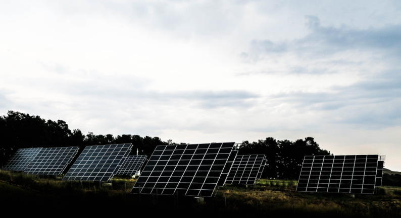
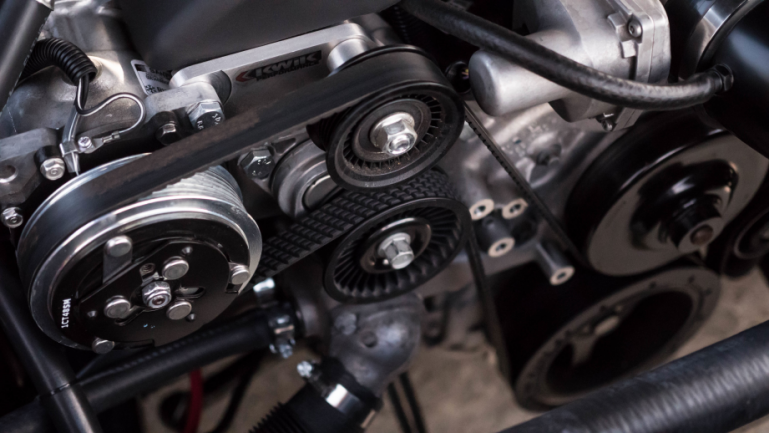

# nugraha.github.io

#About This Site
This site is about how Company could achieve efficiency on industrial purchase order service, provide complete industrial inquiry from small to biggest part. We commit to bring solution for safety, renewable energy, technical, electrical and building support. Support by train engineering from many different discipline science & engineering college who trusted in Indonesia. We believe we could change not only your efficiency on your internal company but you hole business access because if you join with this circle you would directly connected to many different company and you could share how to got more efficient for specific purpose part. Usually company got problem with material purpose for many different specification and we believe we could help your every problem.

#Used Tags & Syntaxes
<!--<!DOCTYPE html>
<html lang="en" id="home">
  <head>
    <meta charset="utf-8">
    <meta http-equiv="X-UA-Compatible" content="IE=edge">
    <meta name="viewport" content="width=device-width, initial-scale=1">
    <!-- The above 3 meta tags *must* come first in the head; any other head content must come *after* these tags -->
   <!-- <title>IMPA (Industrial Market Place Agreement)"</title>

    <!-- Bootstrap -->
  <!--  <link href="css/bootstrap.min.css" rel="stylesheet">
    <link href="css/style.css" rel="stylesheet">

    <!-- HTML5 shim and Respond.js for IE8 support of HTML5 elements and media queries -->
    <!-- WARNING: Respond.js doesn't work if you view the page via file:// -->
    <!--[if lt IE 9]>
      
      
    <![endif]-->
  </head>
  <body>

    <!--navbar -->
   <!-- <nav class="navbar navbar-inverse navbar-fixed-top">
      

        

          <button type="button" class="navbar-toggle collapsed" data-toggle="collapse" data-target="#bs-example-navbar-collapse-1" aria-expanded="false">
          Toggle navigation
          
          
          
      </button>
          <a href="#home" class=navbar-brand page-scroll>Nugraha Build-On</a>
        

         

         <ul class="nav navbar-nav navbar-right">
          <li><a href="#about" class="page-scroll">About This Site</a></li>
          <li><a href="#product" class="page-scroll">Product</a></li>
          <li><a href="#me" class="page-scroll">About Me</a></li>
        </ul>
      

      
  

    </nav>  
    <!-- akhir navbar-->
   <!--Jumbotron awal-->
<!--  

    
    <h1>IMPA (Industrial Market Place Agreement)</h1>
    
Industrial Chain Market | New Way To Buy

  

   <!--Jumbotron Akhir-->

   <!-- about -->

<!--  <section class="about" id="about">
    

      

        

          <h2 class="text-center">About This Site</h2>
          

        

      

      

        

          

        

      

    

  </section>
   <!--akhir about -->

<!--Product-->
<!-- <section class="product" id="product">
  

    

      

        <h2 class="text-center">Product</h2>
        

      

    

    

        

          
        

        

          
        

        

          
        

  

</section>
<!--akhir product-->

 <!-- about Me-->

 <!-- <section class="me" id="me">
    

      

        

          <h2 class="text-center">About Me</h2>
          

        

      

      

        

          

  
        

      

    

  </section>
   <!--akhir about Me-->

<!--Footer-->
<!--<footer>
  

    

      

        
&copy copyright 2017 | built by. <a href="">1000pilar</a>.

      

    

  

</footer>

  <!--Footer-->

    <!-- jQuery (necessary for Bootstrap's JavaScript plugins) -->
  <!--  
    
    <!-- Include all compiled plugins (below), or include individual files as needed -->
 <!--   
    

  </body>
</html> -->

#About Me
Author This Site is industrial worker with experience more than 5 years, realize that industrial need more efficient way to buy industrial stuff. We try to find solution for buying system.
